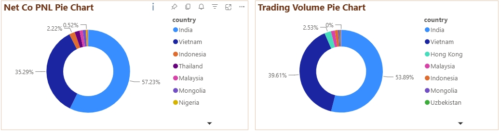

# Unlimited Leverage Report Template

### Weekly Report Template for "APAC\_Product溝通群" Group:

@All 本周無限槓桿數據分享，謝謝\!

**一、基礎數據分享**

1. 3/9 至 6/21無限槓桿上線以來，**累計為公司帶來約 1,828k 的 Net Company PnL，86,723Mil 交易量，淨入金約 2,049K，淨帳戶內轉為$792K**

2. 上週公司PNL \-254K, 表現不佳，主要原因是6/17黃金下跌行情所造成。其中20884988客戶單周獲利293K，且非問題交易，Risk團隊正持續追蹤跟匯報

3. Net PNL國家占比方面，以印度\(62%\)為最高，其次為越南\(31%\)與香港\(2%）

4. 交易量 國家占比方面，以印度\(54%\)為主要，其次為越南\(40%\)與香港\(3%\) 

5. **全量開放之後，暫時還沒有看到其他地區明顯的數據提升**

5. 黃金仍為客戶主要交易產品，占總交易量的 97%，並貢獻 79%的 PnL。交易量排名其次的產品為BTCUSD以及NAS100

6. 上周並沒有問題客戶

**二、整體表現總攬WOW** 06\.15\~06\.21 VS 06\.08\~06\.14

- **交易量（Million Volume）**：**🔴 **\-39%

- **入金（Deposit）**：**🔴 **\-51%

- **淨入金（Net Deposit）**：**🔴 **\-177%

- **Net Company PnL**：**🔴 **\-472%

**三、區域表現**

**交易量前五大區域表現**

1. **交易量成長**

- **India：🔴 \-53%**

- **Vietnam：🔴 \-19%**

- **Hong Kong：🔴 \-29%**

- **Malaysia 🟢 \+43%**

- **Indonesia 🟢 \+403%**

2. **Net Company PNL成長**

- **India：🔴 \-34%**

- **Vietnam：🔴 \-864%**

- **Hong Kong：🔴 \-496%**

- **Malaysia 🟢 \+252%**

- **Indonesia🔴 \-1608%**

### Weekly Report For "New Product Committee" Group:

本周最新無限槓桿數據分享:

無限槓桿帳戶已於6/16完成全量開放。因運營時間較短，暫時沒有發現全量開放地區明顯的數據成長

**一、整體表現總攬WOW** 06\.15\~06\.21 VS 06\.08\~06\.14

- **交易量（Million Volume）**：**🔴 **\-39%

- **入金（Deposit）**：**🔴 **\-51%

- **淨入金（Net Deposit）**：**🔴 **\-177%

- **Net Company PnL**：**🔴 **\-472%

**上週公司PNL \-254K, 表現不佳，主要原因是6/17黃金下跌行情所造成。其中20884988客戶單周獲利293K，Risk有在持續追蹤跟匯報，並沒有發現問題交易**

**二、詳細數據分享 : **

1. 3/9 至 6/21無限槓桿上線以來，**累計為公司帶來約 1,828k 的 Net Company PnL，86,723Mil 交易量，淨入金約 2,049K，淨帳戶內轉為$792K**

3. Net PNL國家占比方面，以印度\(62%\)為最高，其次為越南\(31%\)與香港\(2%）交易量國家占比方面，以印度\(54%\)為主要，其次為越南\(40%\)與香港\(3%\) 

4. 上周並沒有問題客戶

### 29/6/2026 \- Weekly Report — "APAC\_Product溝通群" Group

@All 本周無限槓桿數據分享，謝謝\!

**一、基礎數據分享**

1. 3/9 至 6/28 無限槓桿上線以來，累計為公司帶來約 1,974K 的 Net Company PnL，92,894Mil 交易量，淨入金約 2,450K，淨帳戶內轉為 $1,125K

2. 上週公司 PNL \+$145\.5K，表現轉正回升。6/26 黃金下跌行情中，客戶多頭部位受損，帶動公司 PNL 大幅回升（與上週6/17不同，本週無異常大額空頭部位影響整體PNL）。

3. Net PNL 國家占比方面，以印度（57%）為主要，越南（35%）次之（詳見國家圓餅圖）

4. 交易量國家占比方面，以印度為主要（54%），越南次之（40%）（詳見國家圓餅圖）

5. 黃金（XAUUSD）仍為客戶主要交易產品，占總交易量的 97%，並貢獻 87% 的 PnL。Net PnL 貢獻排名其次的產品為 XAGUSD 以及 USDJPY

6. 本週前五大盈利客戶均來自越南，合計貢獻約 $159\.4K。其中最大獲利客戶為 26744725（越南），單周獲利 $69\.9K。上週持續追蹤之客戶 20884988 本週轉盈 \+$21\.9K，Risk 確認屬正常交易。最大虧損客戶為 7311585（香港），單周虧損 \-$37\.5K，Risk 團隊持續追蹤，未發現問題交易。

**二、整體表現總攬 WOW 06\.22\~06\.28 VS 06\.15\~06\.21**

• 交易量（Million Volume）：🔴 \-2\.96%

• 入金（Deposit）： 🟢 \+64\.15%

• 淨入金（Net Deposit）： 🟢 \+260\.61%

• Net Company PnL： 🟢 \+157\.29%

**三、區域表現**

交易量前五大區域表現

1. 交易量成長

• India： 🟢 \+1\.41%

• Vietnam： 🔴 \-7\.07%

• Hong Kong： 🔴 \-24\.94%

• Malaysia： 🔴 \-36\.11%

• Indonesia： 🔴 \-29\.13%

2. Net Company PNL 成長

• India： 🔴 \-63\.45%

• Vietnam： 🟢 \+151\.1%

• Hong Kong：🟢 \+44\.52%

• Malaysia： 🔴 \-98\.57%

• Indonesia： 🟢 \+2,229\.03%

3. 全量開放後，部分市場出現明顯交易量成長，包含泰國（\+407%）。

### 29/6/2026 \- Weekly Report — "New Product Committee" Group

本周最新無限槓桿數據分享:

Net Company PnL 回升至 \+$145\.5K，

結束上週 \-$254K 的不佳表現。入金及淨入金均有大幅回升，整體動能改善明顯。

**一、整體表現總攬 WOW 06\.22\~06\.28 VS 06\.15\~06\.21**

• 交易量（Million Volume）：🔴 \-2\.96%

• 入金（Deposit）：       🟢 \+64\.15%

• 淨入金（Net Deposit）：  🟢 \+260\.61%

• Net Company PnL：       🟢 \+157\.29%

上週公司 PNL \+$145\.5K，表現轉正。6/26 黃金下跌行情中，客戶多頭部位受損，帶動公司 PNL 大幅回升。主要受惠於越南市場客戶表現強勁，前五大盈利客戶均來自越南，合計貢獻約 $159\.4K，其中最大獲利客戶 26744725 單周獲利 $69\.9K。上週追蹤客戶 20884988 本週轉盈 \+$21\.9K，Risk 確認屬正常交易。最大虧損客戶為 7311585（香港），虧損 \-$37\.5K，Risk 有在持續追蹤，並沒有發現問題交易。

**二、詳細數據分享：**

1. 3/9 至 6/28 無限槓桿上線以來，累計為公司帶來約 1,974K 的 Net Company PnL，92,894Mil 交易量，淨入金約 2,450K，淨帳戶內轉為 $1,125K

2. Net PNL 國家占比方面，以印度為主要\(57%\)，越南次之\(35%\)；交易量國家占比方面，以印度為主要\(54%\)，越南\(40%\) 次之

3. 上周並沒有問題客戶

